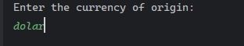
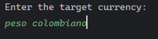
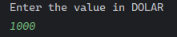
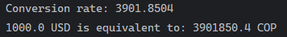
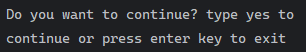
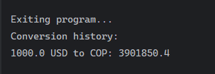

# Currency converter

## Overview

This project is a Currency Exchange Rate Converter, developed in Java, aimed at providing users with real-time 
exchange rates for various currencies. It utilizes the HttpResponse and HttpRequest classes for API communication, 
List, ArrayList, and Map for data handling, and Scanner for user input.

## Features
- Real-time Exchange Rates: The application fetches the latest exchange rates from an API, ensuring accuracy and reliability.
- Currency Conversion: Users can input the currency they have and the currency they want to convert to, and the software calculates and displays the converted amount.
- Support for Multiple Currencies: The system supports a wide range of currencies, enabling conversions for various international transactions.

## How to Use

1. **Enter the currency of origin**

   

2. **Enter the target currency**

   

3. **Enter the value in the currency of your choice**

   

4. **Press enter**

   

5. **The system will show you the exchange rate for that currency and give you the option to type yes, if you want to do another conversion or you can press enter to exit.**

   

6. **After you exit it will show you a history of all the conversions you have made.**

   

## Technologies Utilized:

- Java Programming: The project is developed entirely in Java.
- API Integration: Utilizes Java's HttpResponse and HttpRequest classes to communicate with the currency exchange rate API.
- Data Handling: Utilizes List, ArrayList, and Map for efficient data storage and manipulation.
- User Input: Scanner is used to handle user input for currency conversion.

## Key Features:

User Authentication: The frontend includes login and registration forms, allowing users to securely authenticate and access the chat functionalities upon successful login.

Real-time Messaging: Leveraging WebSocket technology, the frontend enables real-time bidirectional communication between users, ensuring instant message delivery and synchronization across devices.

Responsive Design: The frontend is designed with responsiveness in mind, ensuring optimal user experience across various devices and screen sizes, including desktops, tablets, and mobile phones.

## Prerequisites

- [Git](https://git-scm.com/downloads)
- [JDK](https://www.oracle.com/co/java/technologies/javase/javase8-archive-downloads.html) 
- [gson](https://mvnrepository.com/artifact/com.google.code.gson/gson/2.10.1)

## Starting 🚀

1. Clone the repository:

```shell
git clone https://github.com/jesusdavid24/currency-converter.git
```

2. Navigate to the project directory:

```shell
cd currencyConverter
```

3. Install the dependencies:

```shell
 1. Go to the official MAVEN website and download gson
 2. Click File
 3. project structure
 4. Modules
 5. Dependices
 6. Click en +
 7. Navaga on your pc to where you have saved the gson file that you downloaded before.
 8. Apply
 9. Aceptar
```

4. Start the application:

```shell
 click on run 
```

## Authors 👊

This project was created by [jesusdavid24](https://github.com/jesusdavid24)

## License

[MIT](LICENSE)
